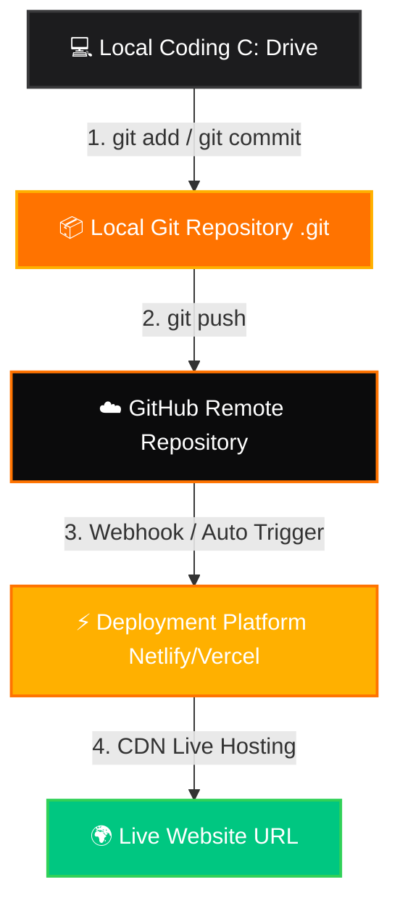

# The Complete Guide to Git & GitHub Deployment 🚀

Welcome! Learning how **Git** and **GitHub** work together to deploy websites is one of the most powerful milestones for any modern developer. This guide breaks down the concepts visually and provides the exact steps to put your project live on the internet.

---

## 🗺️ The Modern Deployment Flow

Below is the path your code travels from your keyboard to a live URL on the web:



When this pipeline is set up, **any time you save a file and push it, your website updates live automatically in less than 30 seconds!**

---

## 🛠️ Step 1: Local Version Control (Git)

**Git** is a software program that runs locally on your computer. It acts like a "Time Machine" for your codebase, recording every single character change.

### The 3 Local Zones of Git:
1. **Working Directory**: The actual files you are editing (e.g., `index.html`, `style.css`).
2. **Staging Area**: A "loading dock" where you select which changes you want to package into your next snapshot.
3. **Local Repository**: The `.git` database on your machine storing your permanent snapshots (commits).

### The Terminal Commands:

#### 1. Initialize Git in the Project Folder
Open your terminal (Command Prompt, PowerShell, or Git Bash), navigate to your folder, and type:
```bash
git init
```
*What this does:* Creates a hidden `.git` folder in your project. This is Git's database.

#### 2. Check the Status
```bash
git status
```
*What this does:* Shows you which files have been modified or are "untracked" (new).

#### 3. Add Files to Staging
```bash
git add .
```
*What this does:* The `.` represents "everything". This copies all your local changes into the staging area (loading dock).

#### 4. Create a Commit (snapshot)
```bash
git commit -m "feat: initial release of Tapify Food dark mode site"
```
*What this does:* Packages up your staged changes into a permanent version snapshot, tagged with a descriptive message (`-m`).

---

## ☁️ Step 2: Cloud Storage (GitHub)

**GitHub** is a cloud platform that hosts Git repositories online. It allows you to store your "Time Machine" database in the cloud and collaborate with others.

### How to Link Your Local Code to GitHub:

1. Go to [GitHub.com](https://github.com) and log in.
2. Click the green **"New"** button to create a new repository.
3. Name your repository (e.g., `tapify-food`) and click **"Create Repository"** (leave "Initialize with README" unchecked).
4. GitHub will show you a page with commands. Copy the commands under **"…or push an existing repository from the command line"**:

```bash
# 1. Rename your default branch to "main" (modern standard)
git branch -M main

# 2. Tell your local Git where your online GitHub repository lives
git remote add origin https://github.com/YOUR_USERNAME/tapify-food.git

# 3. Upload (push) your local commits to the online cloud repository
git push -u origin main
```

---

## ⚡ Step 3: Deployment (Netlify or Vercel)

A **Deployment Platform** connects directly to your GitHub repository. Every time you push a commit, it downloads the code, packages it, and hosts it on high-speed global servers (CDNs) for free.

### How to Deploy (Netlify Method):
1. Sign up for a free account at [Netlify.com](https://www.netlify.com/) using your GitHub account.
2. Click **"Add new site"** ➔ **"Import an existing project"**.
3. Select **GitHub** as your provider. Netlify will ask for permission to view your repositories.
4. Choose your `tapify-food` repository from the list.
5. Leave all build settings blank (since this is a simple static HTML/CSS website, no compile step is needed!).
6. Click **"Deploy site"**.
7. **Done!** Netlify will generate a random URL (e.g., `https://creative-cupcake-12345.netlify.app`) where your Tapify Food website is live! You can customize this domain name for free in Netlify settings.

---

## 🔄 Step 4: The Golden Workflow (How to Update)

Once your pipeline is set up, you never have to visit Netlify or Vercel again. To make a change (e.g., changing a price, updating a text description):

1. Edit your local file in your editor (e.g., changing a price in `index.html`) and save it.
2. Run these 3 simple commands in your terminal:

```bash
# 1. Stage the changes
git add .

# 2. Commit the changes with a note
git commit -m "fix: updated spicy miso ramen price to match local currency"

# 3. Push to GitHub
git push
```

Within **5 seconds** of typing `git push`, GitHub notifies Netlify. Netlify pulls your new code, deploys it, and your live URL displays the new price automatically! 
